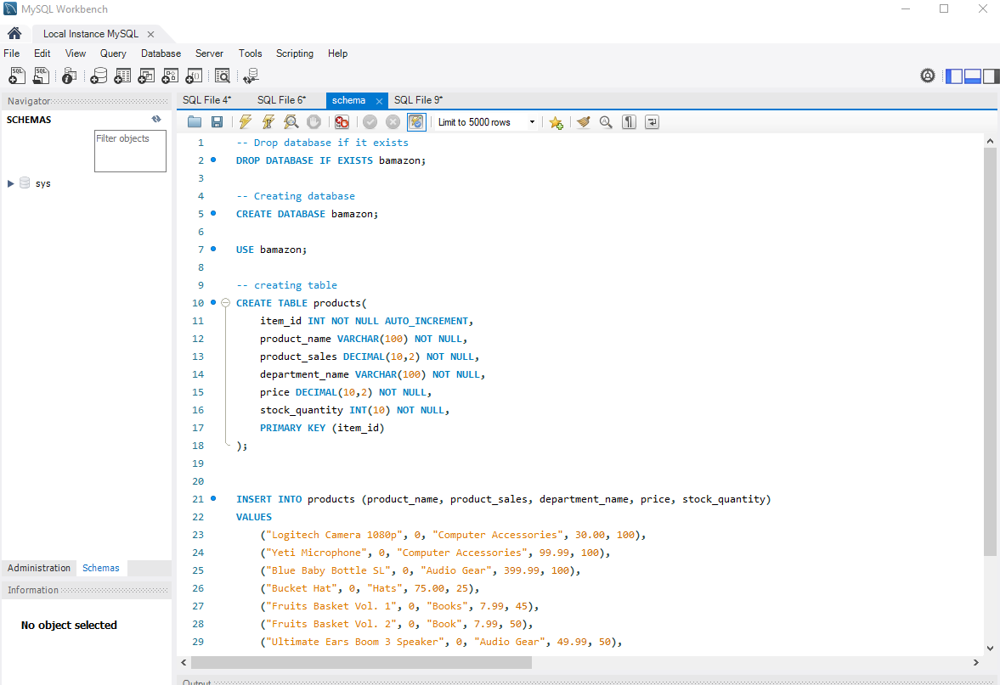
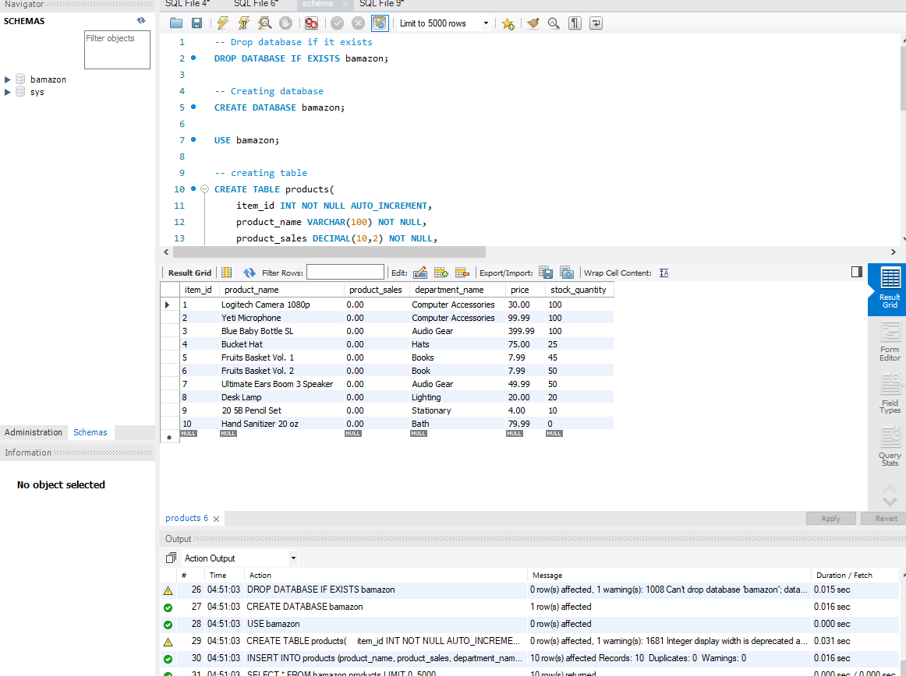
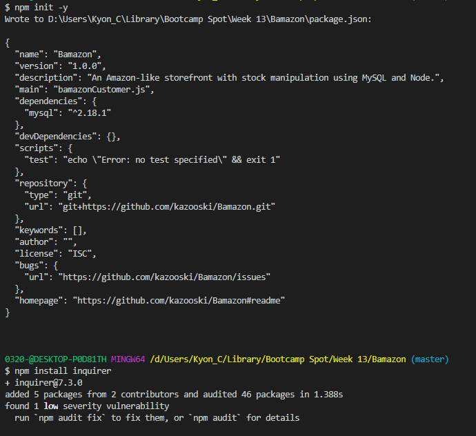
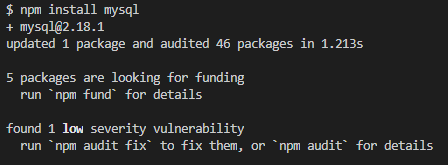
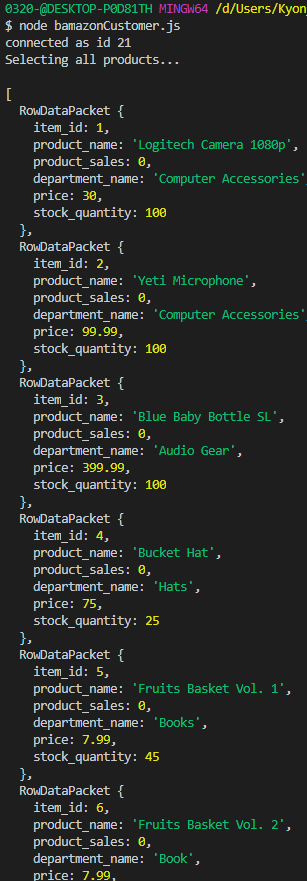
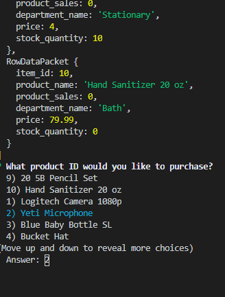
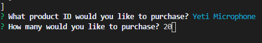
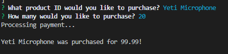
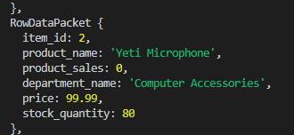
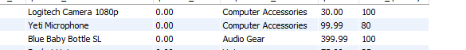

# Bamazon
## Overview

An Amazon-like storefront with stock manipulation using MySQL and Node.

## Customer front

Customers will be able to:

* View the available products and details - in object format

* Select a Product and Quantity

* Purchase the product

Customer will be notified if the product is not available. 

## Functionality

1. Create the bamazon database in MySQL

2. Install NPM packages

3. Run JS file in Node. Results in list of products in object format and first inquiry.

4. Select quantity

5. Payment is processed and invoice is sent

6. New quantity is now available.

7. Routed back to the beginning of a new purchase.